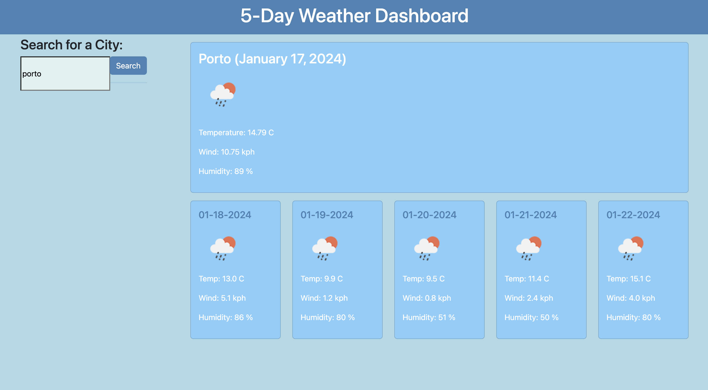

# Server APIs: Weather Dashboard

## Description 

This project involved creating an app that allows users to see the weather forecast for cities of their choosing.

## Installation
<br>

1. Navigate to the repository using the link below: 

```sh
   https://github.com/yasmiinLDN/APIs-for-weather-Yasmiin
   ```
<br>

2. Click the green "< > Code" button to copy the SSH key related to the repository
<br>
<br>
<br>
3. Clone the repository into your local machine using the below command entered into the command line (assuming you have set up your SSH connection correctly to connect your GitHub account to your local machine):

```sh
   git clone git@github.com:yasmiinLDN/APIs-for-weather-Yasmiin.git
   ```
<br>


## Usage 

Below shows the layout of the password generator:




## Credits

This document was created with assistance from the following website:

https://developer.mozilla.org/en-US/docs/Web/JavaScript
<br>

* I worked on this with my tutor - thank you!


## License

This document is distributed under the MIT License. Please see LICENSE.txt for more information.

## Badges

| Javascript            | 
<br>
| HTML5            |       
<br>
| CSS            |  

## Features

### Main scheduler contents
  * The app:
    * Provides a search function for any city's weather
    * Produces weather information for the current day in large format, along with the current day and following four consecutive days.

## Contributing

  

